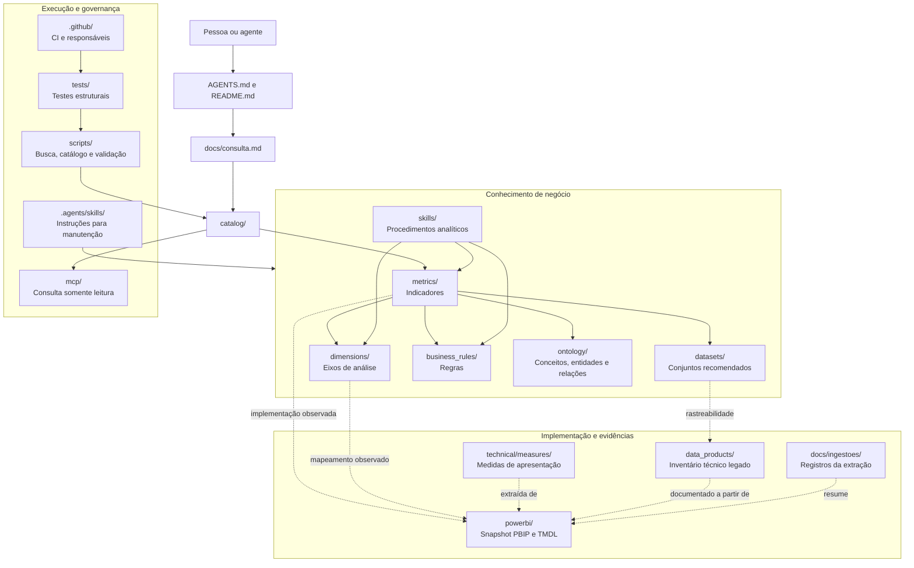
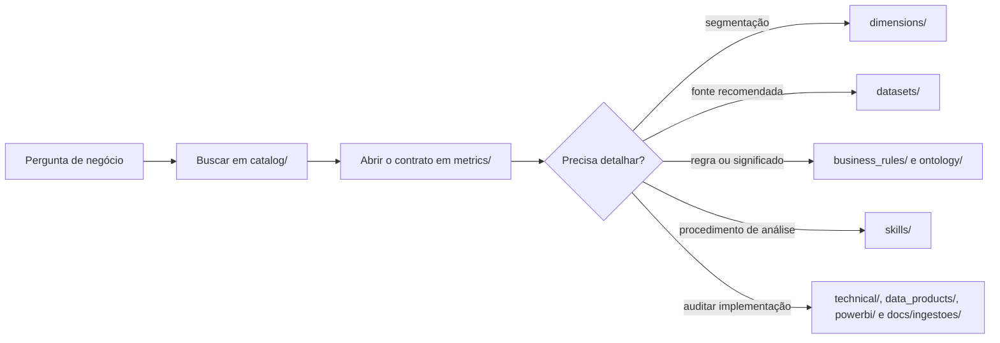

# Estrutura do repositório Atlas

Este documento é um mapa rápido das pastas do Atlas. Ele mostra onde procurar uma definição, como os conteúdos se relacionam e quais áreas devem ser abertas somente quando uma investigação exigir mais evidências.

## Desenho geral



As setas contínuas representam o caminho normal de consulta. As setas tracejadas apontam para implementação ou evidência: servem para auditoria, mas não tornam uma definição oficial.

## Árvore resumida

```text
atlas/
├── metrics/              indicadores de negócio
├── dimensions/           dimensões para segmentar indicadores
├── datasets/             conjuntos de dados orientados ao negócio
├── business_rules/       regras que alteram ou restringem significados
├── ontology/             conceitos, entidades e relacionamentos
├── skills/               procedimentos de análise
├── catalog/              índices JSON gerados
├── mcp/                  acesso do agente ao catálogo
├── docs/                 guias, decisões e registros de ingestão
├── technical/            cálculos técnicos e de apresentação
├── data_products/        inventário técnico legado das tabelas
├── powerbi/              fonte PBIP/TMDL observada
├── scripts/              manutenção, busca e validação
├── tests/                verificações automatizadas
├── .agents/              instruções de trabalho para agentes
└── .github/              validação e revisão no GitHub
```

Os domínios aparecem abaixo das pastas quando existe conteúdo específico, como `comercial/`, `financeiro/`, `logistica/`, `operacoes/` e `corporativo/`.

## Mini documentação das pastas

| Pasta | O que contém | Quando consultar | Regra de manutenção |
|---|---|---|---|
| [`metrics/`](../metrics/) | Contratos canônicos dos indicadores: definição, fórmula, unidade, tempo, filtros, dependências, fontes e estado de validação. | Primeira leitura depois que a busca encontra a métrica. | Um arquivo por ID. Não copiar a fórmula para documentos auxiliares. |
| [`dimensions/`](../dimensions/) | Chaves e atributos usados para analisar métricas por cliente, produto, empresa, tempo, regional e outros eixos. | Para segmentar uma métrica ou entender um filtro. | Compatibilidade observada não equivale a compatibilidade aprovada. |
| [`datasets/`](../datasets/) | Contratos orientados ao negócio que ligam métricas e dimensões a objetos físicos. | Para decidir qual conjunto usar em uma análise. | Registrar granularidade, usos recomendados e rastreabilidade; manter como rascunho quando faltarem confirmações. |
| [`business_rules/`](../business_rules/) | Regras de datas, bases de receita, projeções, classificação, carteira e outras condições de negócio. | Quando a resposta depende de uma exceção ou regra compartilhada. | Referenciar métricas por ID e registrar autoridade, vigência e pendências. |
| [`ontology/`](../ontology/) | `concepts/` define vocabulário e sinônimos; `entities/` descreve objetos do negócio; `relationships/` registra relações e joins observados. | Para resolver ambiguidades e entender como objetos se conectam. | Separar relações conceituais de joins físicos e explicitar riscos de cardinalidade. |
| [`skills/`](../skills/) | Procedimentos analíticos reutilizáveis, como a investigação de carteira. | Para responder “como analisar?” ou “por que subiu ou caiu?”. | Usar os contratos canônicos e separar fatos, hipóteses e limitações. |
| [`catalog/`](../catalog/) | Índices compactos em JSON para métricas, dimensões, datasets, conceitos, regras e skills. | Na busca inicial de pessoas, agentes e integrações. | Conteúdo gerado por `scripts/atlas.py`; nunca editar manualmente. |
| [`mcp/`](../mcp/) | Servidor Alexandria que expõe o conhecimento do Atlas em modo somente leitura. | Para conectar o repositório a um agente ou ao Copilot Studio. | Não executa DAX/SQL, não consulta valores atuais e não altera contratos. |
| [`docs/`](./) | Guias de consulta, catálogos para leitura humana, decisões, roadmap e documentação da carga inicial. | Para navegação, contexto de governança e histórico das escolhas. | Manter orientação curta no nível principal; detalhes da extração ficam em `docs/ingestoes/`. |
| [`technical/`](../technical/) | Medidas auxiliares, seletores, HTML, cores e cálculos de apresentação do relatório. | Ao investigar comportamento visual ou dependências indiretas. | Não apresentar esses objetos como indicadores de negócio. |
| [`data_products/`](../data_products/) | Inventário técnico legado de tabelas e colunas encontradas na primeira carga. | Para auditoria e rastreabilidade até objetos físicos. | O nome histórico da pasta não significa que cada arquivo seja um produto de dados governado. |
| [`powerbi/`](../powerbi/) | Snapshot do projeto Power BI: modelo semântico, relações, medidas, páginas, visuais, temas e funções de segurança. | Para conferir a implementação original observada. | Tratar como evidência bruta; não carregar por padrão no contexto do agente. |
| [`scripts/`](../scripts/) | Extração inicial, construção dos catálogos, busca, expansão de contexto e validações. | Na manutenção local e na automação do repositório. | Scripts de ingestão não devem sobrescrever contratos que já receberam curadoria. |
| [`tests/`](../tests/) | Testes de IDs, referências, governança, busca, ciclos, links e catálogos gerados. | Antes de enviar qualquer alteração. | Testes estruturais aprovados não certificam cálculos nem resultados de negócio. |
| [`.agents/`](../.agents/) | Skill com o padrão de documentação e manutenção usado por agentes. | Antes de criar, alterar ou reorganizar conteúdo. | É instrução operacional, não conhecimento de negócio recuperável em uma pergunta. |
| [`.github/`](../.github/) | Workflow de validação e responsáveis por revisão de cada área. | Para entender o que roda no GitHub e quem revisa mudanças. | Atualizar quando o processo de revisão ou validação mudar. |

## Arquivos da raiz

| Arquivo | Função |
|---|---|
| [`README.md`](../README.md) | Guia completo do Atlas para pessoas: propósito, governança, estrutura, consulta e contribuição. |
| [`AGENTS.md`](../AGENTS.md) | Primeira instrução para qualquer agente que entre no repositório. |
| [`requirements.txt`](../requirements.txt) | Dependências Python necessárias para busca, validação e MCP. |
| `.gitignore` | Arquivos locais que não devem ser versionados. |

## Caminho recomendado para uma pergunta



Para uma consulta comum, o agente deve parar assim que tiver definição, estado, filtros, fonte e limitações suficientes. As pastas de evidência entram apenas quando a pergunta exigir reprodução técnica ou auditoria.
