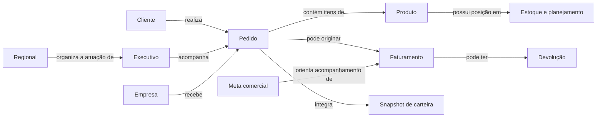

# Mapa conceitual do BI

Esta é uma interpretação inicial dos campos, métricas e relações encontrados. As entidades estão em `draft`. Setas representam hipóteses de negócio para revisão, não cardinalidades nem joins automaticamente executáveis.

## Entidades e evidências

| Entidade | Contrato | Observação |
|---|---|---|
| Cliente | [cliente](../../ontology/entities/cliente.yaml) | chave_cliente; cliente_grupo não é necessariamente um cliente individual. |
| Produto | [produto](../../ontology/entities/produto.yaml) | codigo_produto; marca, EAN e SKU precisam de distinção. |
| Empresa | [empresa](../../ontology/entities/empresa.yaml) | Company no relacionamento; Empresa e Description nos filtros. |
| Executivo | [executivo](../../ontology/entities/executivo.yaml) | executivo_chave; atributos de coordenador e gerente. |
| Regional | [regional](../../ontology/entities/regional.yaml) | Regional comercial não equivale a região geográfica. |
| Pedido | [pedido](../../ontology/entities/pedido.yaml) | Chave única do item não confirmada. |
| Faturamento | [faturamento](../../ontology/entities/faturamento.yaml) | Data de movimento difere de data de pedido. |
| Devolução | [devolucao](../../ontology/entities/devolucao.yaml) | Regras de depósito 52 nas medidas. |
| Meta | [meta_comercial](../../ontology/entities/meta_comercial.yaml) | Metas têm granularidade e base próprias. |
| Estoque | [posicao_estoque](../../ontology/entities/posicao_estoque.yaml) | Snapshot e unidade de cobertura precisam de confirmação. |
| Carteira | [snapshot_carteira](../../ontology/entities/snapshot_carteira.yaml) | data_carteira ancora o histórico. |

Os 28 relacionamentos físicos do modelo estão no [mapa técnico](modelo.md). As dimensões e os 16 conceitos iniciais estão no [catálogo](../catalogo.md).

## Distinções que o agente deve preservar

- Venda, faturamento, RSL e RL representam cálculos diferentes.
- Estoque é posição; venda/faturamento são fluxos. Não somar snapshots como movimentos.
- Campo chamado código pode estar configurado com `summarizeBy: sum`; isso não transforma a chave em indicador somável.
- Regional, UF e região de cliente não são níveis intercambiáveis.
- Dependência de uma coluna ou relacionamento observado não prova que uma dimensão é válida para qualquer métrica.
- Um filtro de página pode ser ignorado ou reconstruído por REMOVEFILTERS e filtros internos do HTML.
